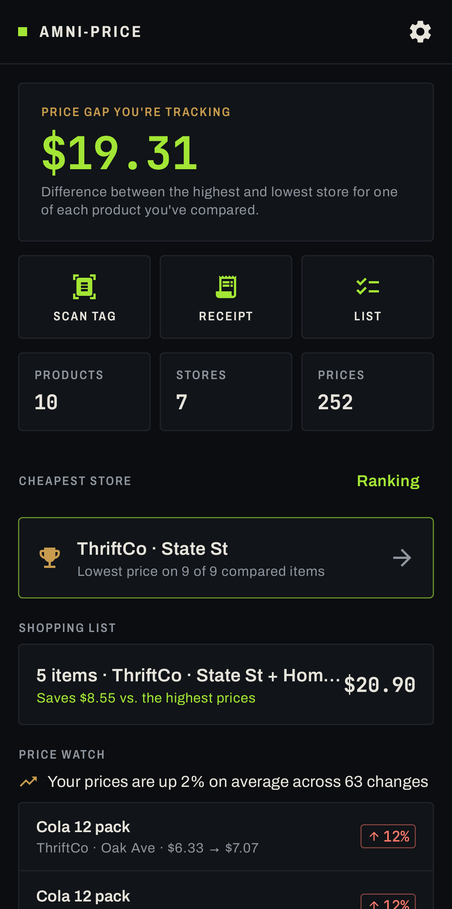
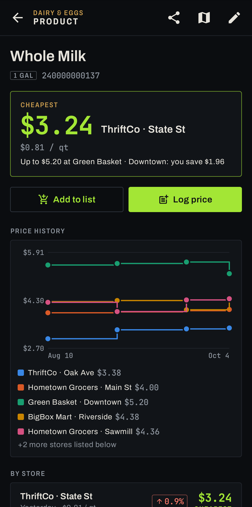
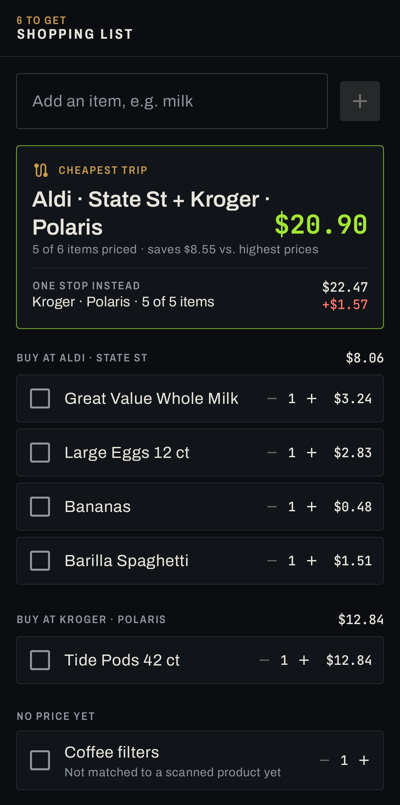
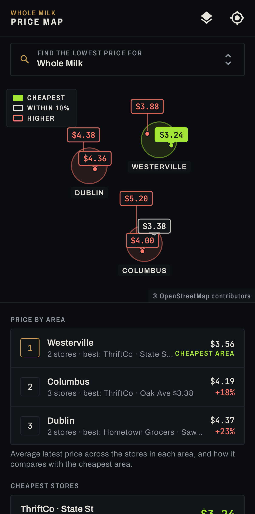

# Amni-Price

**Find out who's really cheapest.** Point your phone at a shelf tag or a receipt. Amni-Price
reads the price with on-device OCR, matches it to the product, and builds your own price
intelligence across every store you shop at.

Retailers use algorithms and AI to set prices by store, by day and by shopper. Amni-Price is
the consumer's side of that shelf: a fast, private record of what things *actually* cost, so
you can see which business really has the most affordable goods.

<p>
  
  
  
  
</p>

## Features

**Scan**
- **Live shelf-tag reading.** CameraX and ML Kit read price, name, size and barcode in real
  time. Multi-buys ("2 for $5") become per-item prices, unit-price lines are ignored, sale tags
  are flagged. Tap to focus, pinch to zoom, flashlight, and a haptic tick on each detection.
- **One-tap save.** Choose the store you're in once, then save each item with one tap. A
  duplicate guard skips re-saving the same price, and a counter tracks your in-store session.
- **Price change at a glance.** Rescan something and see "↑ 8%" vs. your last visit, plus the
  best known price elsewhere ("Cheaper at Aldi · $3.38").
- **Receipts.** Snap a receipt, or pick a photo. Every line is extracted, coupons are applied to
  the right item, "2 @ 1.99" quantities become unit prices, and the store and date are read
  from the receipt. Abbreviations like `GV WHL MLK` or `LG EGGS 12CT` are fuzzy-matched to
  products you've already logged.

**Understand**
- **Home overview.** The price gap you're tracking, the cheapest store, your personal
  inflation rate, the biggest recent price changes, and recent scans.
- **Cheapest-store ranking.** A price index across every product seen at 2+ stores
  ("Kroger +19% vs. cheapest").
- **Product pages.** A price history chart per store (drag to scrub), latest price by store with
  changes, unit prices that pick a sensible unit (per oz/lb/qt, or 100 g/kg/L), and a full
  observation log with undo.
- **Store pages.** Rank, index, visits, and every price there vs. the best elsewhere.
- **Auto categories.** Products are sorted into Produce, Dairy & eggs, Pantry and so on. Filter
  and sort the comparison by category, price gap, recency or name.

**Map**
- **Price map.** Pick any product and see every store's price pinned on the map, colored
  against the cheapest (cheapest / within 10% / higher; the label always shows the number).
  Areas are circled and ranked by average price ("Westerville $3.56 · cheapest area,
  Columbus +18%, Dublin +23%"), and the cheapest stores are listed with their distance from you.
- **Overall mode** ranks areas by the whole-basket store price index: where shopping is
  cheapest in general, not only for one item.
- **Store locations** come from "Pin to where I am" when you add a store, "I'm here now" on a
  store page, or a drag-to-place map picker. The town is filled in automatically. Branches of
  the same chain (Kroger · Main St vs. Kroger · Westerville) are kept separate.
- **"You're at Aldi?"** The scanner suggests switching when you're standing in a saved store.

**Act**
- **Shopping list + trip planner.** Add items, linked to your products automatically. The
  planner finds the cheapest single store *and* the cheapest two-store split, groups the list
  by where to buy each item, and shows what you save.
- **Share** a product's prices as text, or **export/import CSV** to pool prices with family or a
  group.

**Private by design.** OCR and barcode models ship inside the APK. No account, no ads, no
trackers. Your prices and location never leave the phone unless you export them. The only
network use is downloading map images for the area you're viewing.

## Design

Amni-Price uses the Amniscient identity: cool graphite and machined brass, the **Archivo**
variable typeface (condensed caps for labels), **JetBrains Mono** for every number, hairline
borders instead of shadows, and 2/3/4dp radii. Its app color is *receipt lime*, the color of a
good deal. Light and dark themes are both designed; chart colors are CVD-validated for both.
See `ui/theme/`.

## Build

Requirements: JDK 17+ and the Android SDK (platform 35). Android Studio works out of the box.

```bash
./gradlew :app:testDebugUnitTest    # unit + screenshot tests
./gradlew :app:assembleDebug        # app/build/outputs/apk/debug/app-debug.apk
./gradlew :app:installDebug         # install on a connected device
./gradlew :app:recordRoborazziDebug # regenerate app/screenshots/ after UI changes
```

### Map tiles (before publishing)

The map uses OpenStreetMap data through [osmdroid](https://github.com/osmdroid/osmdroid), with
no API key needed. By default it loads tiles from OpenStreetMap's public servers, which are for
development and light use only ([tile usage policy](https://operations.osmfoundation.org/policies/tiles/)).
Before a public release, point it at a tile provider you have an account with:

```properties
# gradle.properties or local.properties
amni.mapTileUrl=https://api.maptiler.com/maps/streets-v2/256/{z}/{x}/{y}.png?key=YOUR_KEY
amni.mapAttribution=© MapTiler © OpenStreetMap contributors
```

Tiles are recolored in-app to match the theme (`map/MapTiles.kt`), so any standard style works.

Debug builds have **Settings → Load sample data** (seven stores in three towns, eight weeks of prices) for
trying every feature without going shopping. Before sending a change, run
`./gradlew :app:testDebugUnitTest :app:lintDebug` locally.

## Project layout

```
app/src/main/java/com/amniscient/price/
├── domain/      Pure Kotlin, no Android, fully unit-tested
│   ├── PriceParser      shelf tag → price, name, size, sale flag
│   ├── ReceiptParser    receipt rows → items, coupons, quantities, total, store, date
│   ├── RowGrouper       re-joins OCR column blocks into receipt rows
│   ├── ProductMatcher   fuzzy receipt-abbreviation → product matching
│   ├── Categorizer      keyword auto-categories
│   ├── UnitParser       sizes → normalized quantity, unit-price labels
│   ├── StoreRanker      cheapest-store price index
│   ├── PriceInsights    price changes, personal inflation, potential savings
│   ├── RegionalPrices   price by area, cheapest nearby, price bands
│   ├── Geo              distances, geohash cells
│   └── TripPlanner      cheapest single store / multi-store split for a list
├── data/        Room (stores, products, prices, shopping list), repository, settings, location, demo data
├── map/         Map tile source + brand color filter
├── scan/        ML Kit wrapper (VisionEngine) and the scan → review hand-off
└── ui/          Compose screens: home, scan, review, compare, map, stores, list, settings, onboarding
    ├── theme/       Amniscient colors, type, shapes
    └── components/  Panel, AmniTopBar, PriceText, TrendBadge, pickers…
```

## Extending it

| Want to… | Change |
| --- | --- |
| Improve price detection | `domain/PriceParser.kt` + a case in `PriceParserTest` |
| Handle a store's receipt quirks | `domain/ReceiptParser.kt` + a sample receipt in `ReceiptParserTest` |
| Better abbreviation matching | `domain/ProductMatcher.kt` + `ProductMatcherTest` |
| Add a category keyword | the lists in `domain/Category.kt` |
| Add a unit ("dozen") | `UnitParser` regex + `factor()` |
| Swap the OCR engine | implement `analyze`/`readText` like `scan/VisionEngine.kt`; everything downstream uses `OcrLine` |
| Add a screen | composable + ViewModel in `ui/`, route in `ui/AmniPriceRoot.kt`, dependencies via `appViewModel { … }`, a shot in `ScreenshotTest` |
| Add a database field | `data/Entities.kt`, bump `AppDatabase.version`, add a `Migration`, extend `MigrationTest` |
| Change how areas are grouped | `domain/RegionalPrices.regionKey` (town name, else ~5 km geohash cell) |
| Change the map provider/look | `amni.mapTileUrl` + `map/MapTiles.filter` |
| Community price sharing | build on `PriceRepository.exportCsv()` / `importCsv()`, or add a sync source beside it |

### Roadmap

- Opt-in community price sharing so prices crowd-source across shoppers
- Crowd-sourced prices on the map, so areas you haven't shopped show up too
- Price-drop alerts for items on your list
- Online listings via the share sheet

## Contributing

Contributions are welcome: better price and receipt parsing, store receipt quirks, translations,
an open-source OCR backend, and the roadmap items above. Open an issue to discuss bigger changes,
then send a pull request with tests for anything in `domain/`. The "Extending it" table shows where
each kind of change goes.

## License

GPL-3.0-or-later. See `LICENSE`. Fonts and libraries: see `THIRD_PARTY_NOTICES.md`.
